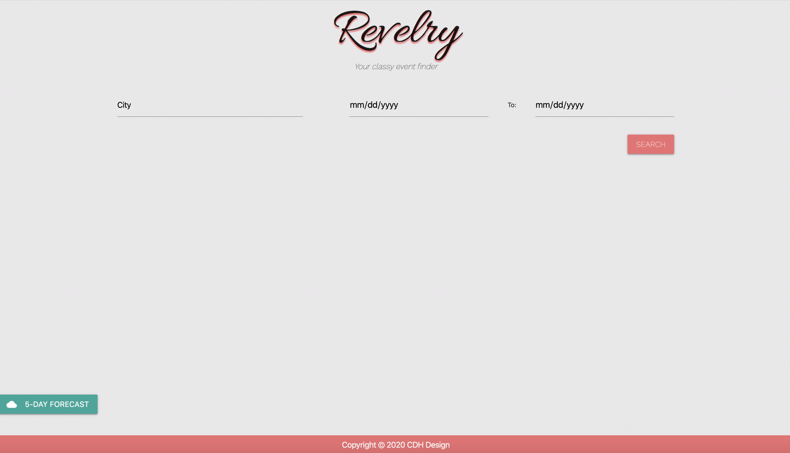

# Revelry-Event-Finder

Deployed: https://phoenix-99hp.github.io/Revelry-Event-Finder/

This is an event finder that finds up to 199 events through the ticketmaster api. 5 events from a specified city are loaded into the main content area between the dates specified, and more events can be loaded by clicking the "More" button. Additionally, a 5-day weather forecast is provided in the specified city via an api call to the openweathermap api. 

This was a group project, so credit is due to hthomas93 (https://github.com/hthomas93) and krislg420 (https://github.com/krislg420) for their contributions. The original version can be found at https://phoenix-99hp.github.io/Project1/. 

I decided to make a few adjustments of my own accord such as adding "to:" between the two date fields so that users would know intuitively that the date fields pertain to a range. I also made some styling changes such as adding all the input fields to a single line, and I made corresponding adjustments to ensure that the site would be responsive. 

